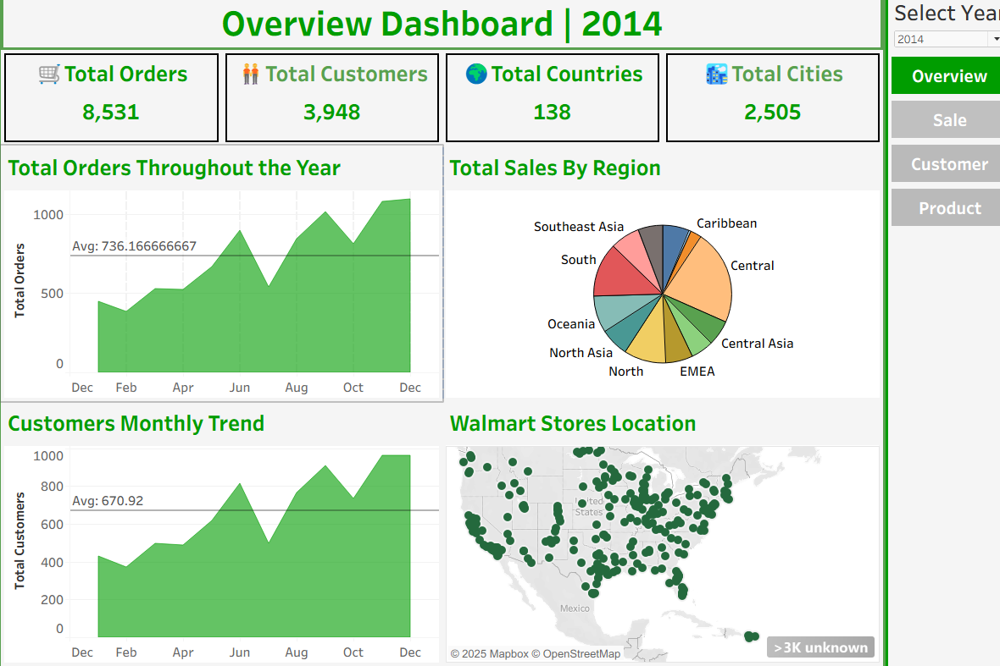
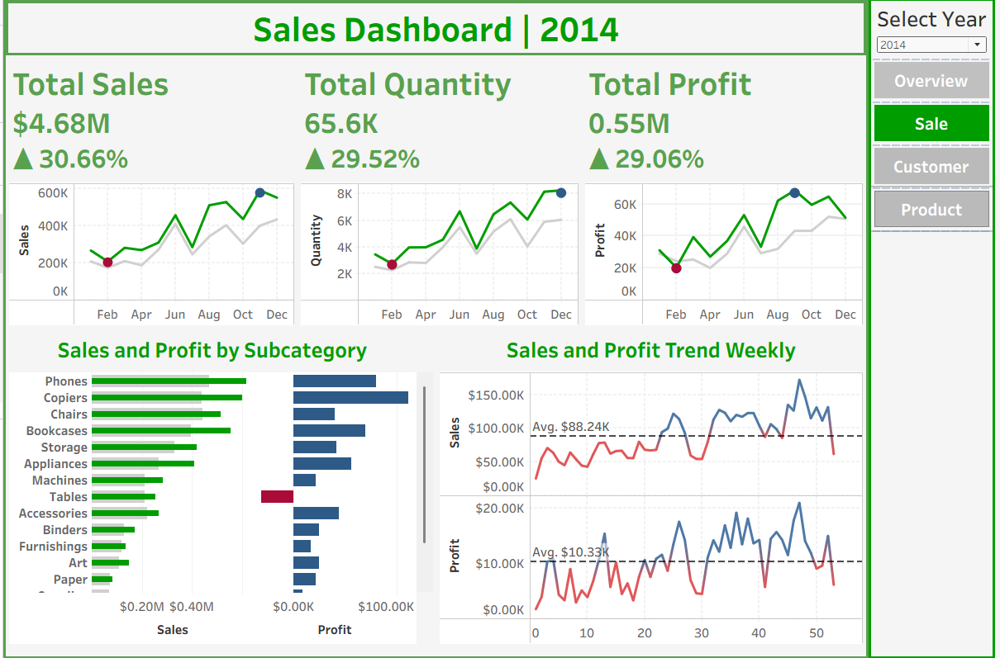
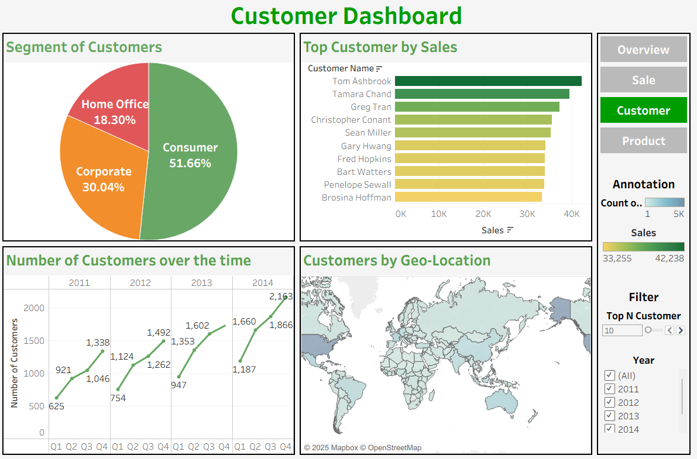
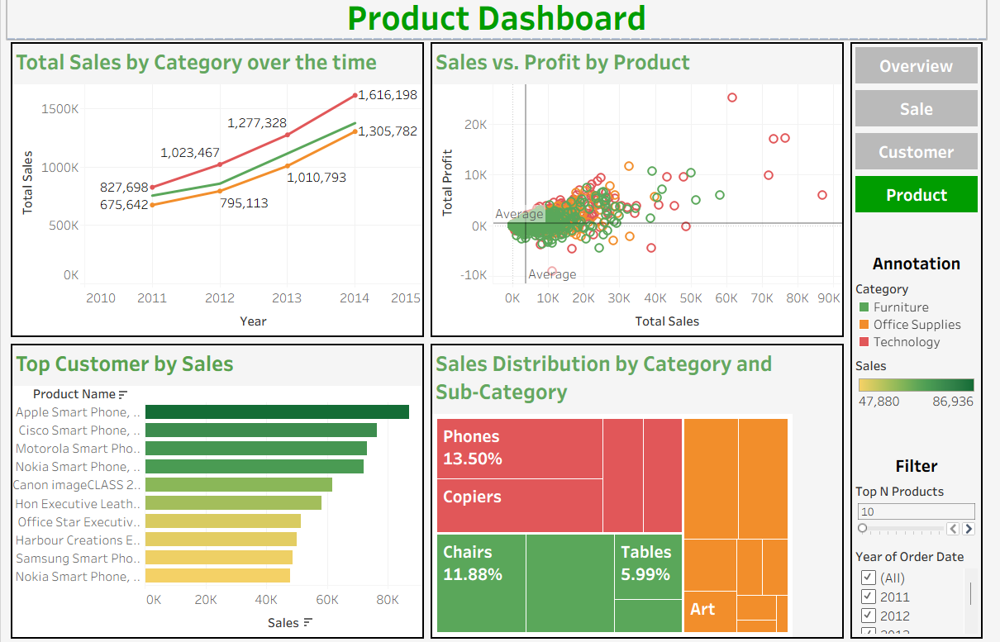

# Walmart Sales Performance Analysis
## Link to dashboard:
- Google Looker Studio: https://lookerstudio.google.com/u/0/reporting/f4b0df0e-0022-4392-aab4-e93c9824215c/page/p_9app2a24td
- Tableau: https://public.tableau.com/app/profile/truong.kiet2362/viz/BigD_seminar_17542261403010/CustomerDashboard
## Introduction

Walmart is one of the world's largest and most well-known retail chains, often referred to as a "Global Superstore." Founded in 1962 by Sam Walton in Rogers, Arkansas, Walmart has grown to become a multinational retail giant with a presence in various countries. It's known for its vast and diverse product offerings, including groceries, electronics, clothing, household goods, and more.

## Purpose of project
The main goal of this project is to gain understanding from Walmart's sales data, exploring the various factors that influence sales across different branches.

## About data

### Dataset Overview
The dataset contains **51,292 records** of global superstore sales data spanning from **2011 to 2014**. This comprehensive dataset provides detailed insights into retail operations across multiple markets, regions, and product categories.

### Data Structure
The dataset consists of **26 columns** capturing various aspects of sales transactions:

#### Key Dimensions:
- **Geographic Information**: Country, State, City, Region, Market
- **Customer Details**: Customer ID, Customer Name, Segment (Consumer, Corporate, Home Office)
- **Product Information**: Category, Sub-Category, Product ID, Product Name
- **Order Details**: Order ID, Order Date, Ship Date, Ship Mode, Order Priority
- **Financial Metrics**: Sales, Profit, Discount, Shipping Cost, Quantity

#### Categories Covered:
- **Office Supplies**: Paper, binders, storage, supplies
- **Technology**: Phones, copiers, machines, accessories  
- **Furniture**: Chairs, tables, furnishings, bookcases

### Geographic Coverage
The dataset spans multiple markets including:
- **North America**: United States, Canada, Mexico
- **EMEA** (Europe, Middle East, Africa): Various European countries, Turkey, South Africa
- **APAC** (Asia-Pacific): Australia, China, India, Japan, and other Asian markets
- **LATAM** (Latin America): Brazil, Argentina, and other South American countries

### Customer Segments
- **Consumer**: Individual customers (majority segment)
- **Corporate**: Business customers
- **Home Office**: Small business/home office customers

### Time Period
- **Date Range**: January 2011 - December 2014
- **Temporal Features**: Includes year extraction and week numbers for time-series analysis

### Key Metrics Available
- **Sales Performance**: Total sales revenue per transaction
- **Profitability**: Profit margins and profit per product/order
- **Discount Analysis**: Discount rates applied to products
- **Shipping Analysis**: Shipping costs and delivery modes
- **Quantity Analysis**: Units sold per transaction

This rich dataset enables comprehensive analysis of sales trends, customer behavior, regional performance, product profitability, and seasonal patterns across Walmart's global operations.

## Overview Analysis

### The Big Picture: Walmart's 2014 Global Operations

When we look at Walmart's 2014 performance from a bird's eye view, the scale of operations is truly impressive. The company successfully processed 8,531 orders throughout the year, serving 3,948 unique customers across an incredible geographic footprint. What makes this particularly remarkable is the global reach - Walmart operated in 138 different countries and maintained a presence in 2,505 cities worldwide. This massive operational scope demonstrates the company's evolution from a regional retailer to a truly global superstore.

### Understanding Customer Behavior and Seasonal Patterns

The monthly trends reveal fascinating insights about how customers interact with Walmart throughout the year. On average, the company handled about 736 orders per month, but this wasn't a steady, unchanging number. Instead, there was a clear pattern of growth that started gaining momentum around mid-year and reached its peak during the fourth quarter, with December showing the strongest performance.

What's equally interesting is the customer engagement story. With an average of 671 customers per month, Walmart maintained a healthy relationship between its customer base and order volume. The data shows that as more orders came in, more customers were also joining the Walmart ecosystem. This parallel growth suggests that the company wasn't just getting more business from existing customers, but was also successfully attracting new ones throughout the year.

### Walmart's Global Footprint: A World of Opportunities

Looking at the geographic distribution, Walmart's international strategy becomes clear. The company has established a particularly strong presence in the Asia-Pacific region, with significant operations across Southeast Asia, Central Asia, and Oceania. This strategic positioning makes sense given the region's economic growth and emerging market opportunities.

The company also maintains robust operations across Europe, the Middle East, and Africa (EMEA), demonstrating its ability to adapt to diverse market conditions and regulatory environments. In the Americas, Walmart has achieved comprehensive coverage across both North and South American markets, while also establishing a notable presence in the Caribbean region.

This geographic diversity isn't just about being everywhere - it's about smart positioning. By maintaining operations across six major global regions, Walmart has created a balanced portfolio that includes both established developed markets and high-growth emerging economies. The presence of over 3,000 store locations worldwide, as indicated by the map markers, shows the physical infrastructure supporting this global reach.

### Growth Story: Building Momentum Throughout 2014

The 2014 performance data tells a compelling growth story. Both order volume and customer metrics moved in the same positive direction, indicating healthy business expansion rather than just temporary spikes. The consistent upward trend from summer through year-end suggests that Walmart's growth wasn't accidental - it was the result of strategic planning and effective execution.

The seasonal patterns are particularly telling. The strong fourth-quarter performance, especially the December peak, highlights Walmart's ability to capitalize on holiday shopping trends. But perhaps more importantly, the steady acceleration from mid-year shows that the company built momentum gradually rather than relying solely on seasonal surges.

The correlation between customer growth and order volume is especially encouraging for long-term business health. When customer acquisition follows the same upward trajectory as order processing, it indicates genuine market expansion rather than just increased spending from a static customer base. This suggests that Walmart's 2014 performance was built on a foundation of both customer loyalty and successful new customer acquisition.

### What This Means for Walmart's Market Position

The 2014 overview data positions Walmart as a mature, globally-diversified retailer with strong operational capabilities. The ability to successfully serve nearly 4,000 customers across 138 countries while processing over 8,500 orders demonstrates operational excellence at scale. The consistent growth patterns suggest a company that has found effective strategies for both customer retention and acquisition, while the geographic diversification provides resilience against regional economic fluctuations.

## Sales Analysis

### Overall Financial Performance in 2014

Looking at Walmart's 2014 financial results, the company achieved impressive growth across all major metrics. The total sales reached $4.68 million, representing a strong 30.66% increase from the previous year. This growth was supported by selling 65.6 thousand units (up 29.52%) while generating $0.55 million in profit (up 29.06%). With a healthy profit margin of approximately 11.75%, the company maintained efficient operations while scaling its business.

### How Sales Evolved Throughout the Year

The monthly sales data tells an interesting story of steady growth and seasonal patterns. Starting from February, Walmart experienced consistent month-over-month growth, with sales gradually climbing throughout the year. The real excitement happened in the fourth quarter, particularly during October and November, when growth accelerated significantly. December emerged as the star performer with sales reaching around $600,000, clearly benefiting from the holiday shopping season.

What's particularly encouraging is how all three key metrics - sales revenue, quantity sold, and profit - moved in harmony. This alignment suggests that Walmart successfully managed to grow its business without sacrificing profitability, maintaining operational efficiency even during periods of rapid expansion.

### Product Performance: Winners and Challenges

When examining which products drove the most revenue, a clear hierarchy emerges. **Phones** stand out as the absolute champion, generating over $400,000 in sales and leading the technology category. **Chairs** proved to be the furniture category's top performer with over $300,000 in sales, followed closely by **Copiers** at around $250,000. **Bookcases** and **Storage** solutions rounded out the top five, each contributing significantly to the overall sales performance.

From a profitability perspective, technology products like Copiers and Phones, along with Chairs, emerged as the most profitable categories. However, there's one notable concern: Tables actually lost money, showing negative profit margins that need immediate attention. This suggests either pricing issues, high costs, or potential market positioning problems that require strategic review.

### Weekly Performance Patterns

On a weekly basis, Walmart averaged $88,240 in sales and $10,330 in profit. While sales showed some natural fluctuations throughout the year, the overall trajectory remained strongly positive from week 1 through week 50+. Several weeks saw exceptional performance, with sales exceeding $120,000.

Interestingly, profit patterns proved more stable than sales, suggesting effective cost management and pricing strategies. Even when sales experienced temporary dips, profit margins remained relatively consistent, demonstrating the company's ability to maintain operational efficiency regardless of volume fluctuations.

### Key Takeaways and Strategic Insights

The 2014 performance reveals several important insights about Walmart's business. Technology products, particularly phones and copiers, have emerged as significant revenue and profit drivers, suggesting strong market demand and effective positioning in these categories. The furniture segment, led by chairs and bookcases, also performs well, indicating successful penetration of the home and office furnishing market.

The seasonal patterns observed, especially the Q4 surge, highlight the importance of holiday season preparation and inventory management. Walmart's ability to capitalize on this peak period while maintaining consistent growth throughout the year demonstrates operational excellence and market understanding.

However, the negative profitability in the tables category presents both a challenge and an opportunity. This underperforming segment requires strategic attention - whether through pricing adjustments, cost optimization, or potentially reconsidering the product mix.

Looking forward, the consistent ~30% growth rate across all major metrics, combined with strong seasonal performance patterns, positions Walmart well for continued expansion and market leadership.
## Customer Analysis

### Understanding Walmart's Customer Base

Walmart's customer analysis reveals a fascinating portrait of a diverse, growing, and strategically important customer ecosystem. The company serves three distinct customer segments, each with unique characteristics and shopping behaviors that contribute to the overall business success. Understanding these customers - who they are, where they come from, and how they've evolved over time - provides crucial insights into Walmart's market positioning and growth strategies.

### Customer Segmentation: A Balanced Portfolio

The customer base is thoughtfully distributed across three key segments, each representing different market opportunities and business strategies. **Consumer customers** form the backbone of Walmart's business, representing 51.66% of the customer base. These are individual shoppers and families who rely on Walmart for their everyday needs, from groceries to household essentials. This segment's dominance reflects Walmart's successful positioning as America's neighborhood store.

**Corporate customers** represent a substantial 30.04% of the customer base, highlighting Walmart's significant success in the B2B market. These business customers likely include small to medium enterprises, offices, and organizations that purchase supplies, equipment, and bulk items. This segment is particularly valuable as corporate customers typically place larger orders and have more predictable purchasing patterns.

The **Home Office segment**, while smaller at 18.30%, represents an important and growing market. These customers bridge the gap between individual consumers and full corporate accounts - they're likely small business owners, entrepreneurs, freelancers, and remote workers who need professional supplies but don't require full corporate account services. This segment has become increasingly important, especially with the rise of remote work and small business entrepreneurship.

### Top-Performing Customers: The VIP Circle

Looking at the highest-value customers provides insights into Walmart's most important relationships. **Tom Ashbrook** leads the pack as the top customer by sales, followed closely by **Tamara Chand** and **Greg Tran**. These top performers, along with customers like **Christopher Conant**, **Sean Miller**, and others, represent Walmart's most valuable customer relationships.

What's particularly interesting is the range of sales values among top customers - from around $10,000 to over $40,000. This suggests that Walmart successfully serves customers across a wide spectrum of purchasing needs and budgets. The presence of these high-value customers indicates strong customer loyalty and satisfaction, as customers don't typically spend tens of thousands of dollars with a retailer unless they're consistently receiving value.

### Customer Growth: A Four-Year Success Story

Perhaps the most compelling part of Walmart's customer story is the consistent growth trajectory from 2011 to 2014. Starting with just 625 customers in Q1 2011, the company demonstrated remarkable customer acquisition capabilities, ending 2014 with 2,193 customers - representing more than a 250% increase over the four-year period.

The growth pattern tells a story of strategic expansion and market penetration. The early years (2011-2012) showed steady but modest growth, with customer numbers gradually climbing from the mid-600s to over 1,000. However, 2013 marked a turning point, with more aggressive growth that accelerated significantly in 2014. The jump from 1,660 customers in Q3 2014 to 2,193 in Q4 2014 suggests that Walmart's customer acquisition strategies were particularly effective during the holiday season.

This growth pattern isn't just about adding more customers - it represents successful market expansion, effective marketing strategies, and most importantly, customer satisfaction that leads to word-of-mouth referrals and organic growth.

### Global Customer Distribution: Reaching Every Corner

The geographic distribution map reveals Walmart's impressive global customer reach. Customers span across North America, South America, Europe, Asia, Africa, and Oceania, demonstrating the company's successful international expansion strategy. The concentration appears strongest in North America and Europe, which aligns with Walmart's primary market focus, but the presence of customers across emerging markets in Asia, Africa, and South America shows the global appeal of the Walmart value proposition.

This geographic diversity provides several strategic advantages. It reduces dependence on any single market, provides natural hedging against regional economic downturns, and creates opportunities to leverage learnings from one market to benefit others. The global customer base also suggests that Walmart's brand, pricing strategy, and product mix have universal appeal.

### Strategic Implications and Customer Insights

The customer analysis reveals several strategic strengths in Walmart's approach. The balanced segment distribution ensures the company isn't overly dependent on any single customer type, providing stability and diverse revenue streams. The strong corporate presence (30.04%) suggests successful B2B strategies that differentiate Walmart from competitors who focus primarily on individual consumers.

The consistent customer growth, particularly the acceleration in 2013-2014, indicates that Walmart's customer value proposition resonates in the market. The presence of high-value customers spending $40,000+ annually demonstrates that Walmart successfully serves not just budget-conscious shoppers, but also customers with substantial purchasing power.

The global customer distribution positions Walmart for continued international growth while the strong customer acquisition trends suggest effective marketing, competitive pricing, and customer satisfaction strategies.

### Looking Forward: Building on Customer Success

The customer analysis data positions Walmart excellently for future growth. The strong foundation of nearly 2,200 customers by end of 2014, balanced across three strategic segments, and distributed globally, provides multiple pathways for expansion. The proven ability to attract and retain high-value customers, combined with consistent growth in customer acquisition, suggests that Walmart's customer-centric strategies are working effectively and can be scaled for continued success.

## Product Analysis

### The Evolution of Walmart's Product Portfolio

Walmart's product analysis reveals a fascinating story of strategic diversification and market adaptation from 2011 to 2014. The company successfully built a three-pillar product strategy centered around **Technology**, **Office Supplies**, and **Furniture** - each serving different customer needs and market segments. This diversified approach has proven remarkably effective, with total sales across all categories growing from approximately $1.5 million in 2011 to over $4.6 million in 2014, representing more than a 200% increase over the four-year period.

### Category Performance: A Tale of Three Markets

The journey of each product category tells a unique story of market dynamics and strategic positioning. **Technology** emerged as the clear winner, demonstrating explosive growth from around $675,000 in 2011 to an impressive $1.62 million in 2014. This dramatic increase reflects the global digital transformation during this period, with smartphones, tablets, and other consumer electronics becoming essential rather than luxury items.

**Office Supplies** showed steady, consistent growth from approximately $827,000 in 2011 to $1.31 million in 2014. This reliable performance makes sense given that office supplies represent recurring, necessity-based purchases that remain relatively stable regardless of economic conditions. The consistent upward trajectory suggests that Walmart successfully captured market share in this essential category.

**Furniture** experienced more moderate but steady growth, rising from about $795,000 in 2011 to just over $1 million in 2014. While this represents the smallest absolute growth among the three categories, the consistent upward trend indicates that Walmart effectively positioned itself in the home and office furniture market, likely benefiting from economic recovery and increased consumer spending on home improvement.

### Product Profitability: The Sales vs. Profit Dynamic

The scatter plot analysis reveals crucial insights about which products drive both revenue and profitability. Most products cluster around the average profitability line, but several standout performers emerge above the crowd. Products generating $20,000+ in profit while maintaining strong sales volumes represent Walmart's most valuable offerings - these are likely the high-margin technology items and premium furniture pieces that combine strong demand with healthy profit margins.

Interestingly, the data shows a clear relationship between sales volume and profit potential, but also reveals that some high-sales products operate on thinner margins while others achieve exceptional profitability despite lower sales volumes. This suggests that Walmart has successfully developed a balanced portfolio that includes both volume drivers (high sales, moderate margins) and profit maximizers (moderate sales, high margins).

### Top-Performing Individual Products: The Champions

Looking at individual product performance, **Apple Smart Phone** leads the pack with the highest sales among all products, followed closely by **Cisco Smart Phone** and **Motorola Smart Phone**. This dominance of smartphone products aligns perfectly with the broader technology category's stellar performance and reflects the mobile revolution that occurred during this time period.

The presence of multiple smartphone brands in the top performers list demonstrates Walmart's smart strategy of offering customers choice within high-demand categories. Rather than betting on a single brand, Walmart positioned itself as a destination for mobile technology by carrying the most popular brands and models.

Beyond smartphones, products like **Canon imageCLASS** copiers, **Hon Executive Leather** furniture, and various **Office Star Executive** items round out the top performers, showing strength across all three major categories. This diversification among top products provides stability and reduces risk from any single product or brand dependency.

### Category Distribution: Understanding Market Share

The category distribution analysis reveals that **Phones** command 13.50% of total sales, making them the single largest sub-category in Walmart's product mix. This substantial share reflects both the high unit prices of smartphones and their strong demand during the analysis period.

**Copiers** and **Chairs** each represent significant portions of the business at 11.88% and other substantial percentages respectively, demonstrating Walmart's success in office equipment and furniture markets. The presence of **Tables** (5.99%) and **Art** supplies shows the breadth of Walmart's product offering and its ability to serve diverse customer needs.

This distribution suggests a well-balanced product portfolio where no single sub-category dominates excessively, providing stability and multiple growth opportunities. The strong showing of both technology (Phones, Copiers) and furniture (Chairs, Tables) categories validates Walmart's strategy of serving both immediate technology needs and longer-term furniture investment purchases.

### Strategic Product Insights and Market Positioning

The product analysis reveals several key strategic insights about Walmart's market positioning. The technology category's explosive growth demonstrates the company's ability to capitalize on major market trends and consumer behavior shifts. By positioning itself as a reliable source for consumer electronics during the smartphone revolution, Walmart captured significant market share in a high-growth, high-value category.

The steady performance of office supplies validates Walmart's strategy of dominating necessity-based categories. These products provide reliable, recurring revenue streams and help establish Walmart as a one-stop shop for business needs. The consistent growth in this category also suggests successful market share capture from competitors.

The furniture category's growth, while more modest, represents important strategic diversification. Furniture purchases are typically higher-value, lower-frequency transactions that can significantly impact customer lifetime value. Walmart's success in this category demonstrates its ability to compete beyond just everyday essentials and convenience items.

### Looking Ahead: Building on Product Success

The 2011-2014 product performance data positions Walmart exceptionally well for continued growth. The proven ability to identify and capitalize on major market trends (like the smartphone revolution) suggests strong market sensing capabilities. The balanced portfolio across technology, office supplies, and furniture provides multiple pathways for expansion while reducing dependency on any single category.

The presence of multiple top-performing products within each category indicates successful brand partnerships and product selection strategies. This approach of offering choice within popular categories, rather than betting on single products, provides resilience and appeals to diverse customer preferences.

Most importantly, the consistent growth across all three major categories demonstrates that Walmart's product strategy isn't just about riding single trends, but about building a sustainable, diversified product portfolio that can adapt to changing market conditions while continuing to serve evolving customer needs.

## Conclusions

The 2011-2014 analysis positions Walmart as a model of retail excellence, demonstrating how to successfully combine global scale, operational efficiency, strategic diversification, and market adaptability. The company has proven its ability to serve diverse customer needs across multiple product categories while maintaining profitable growth and building sustainable competitive advantages.

The consistent growth patterns, balanced portfolio approach, and successful market trend capitalization suggest that Walmart's strategies and execution capabilities position it exceptionally well for continued success in an increasingly competitive and rapidly evolving retail landscape.

This analysis confirms that Walmart's success isn't accidental or temporary, but rather the result of systematic strategic planning, excellent execution, and continuous adaptation to market opportunities - qualities that will serve the company well in future growth phases and market challenges.
